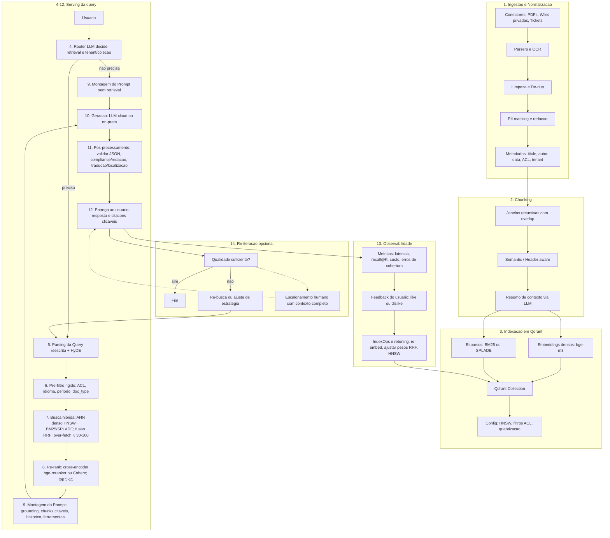

# Assistente Interno de Conhecimento — Arquitetura RAG (Qdrant + Hybrid + HyDE)

## Objetivos do Assistente
Entregar respostas técnicas, confiáveis e citadas a partir de **milhares de PDFs**, **wikis privadas** e **tickets históricos**, em **PT-BR/ES/EN**, com **baixa latência**, **custos previsíveis** e **governança/segurança de nível corporativo**. O assistente deve: (1) **buscar** e **ranquear** trechos mais relevantes; (2) **gerar** respostas fundamentadas com **citações**; (3) respeitar **ACLs/tenant** e políticas de **privacidade**; (4) operar em **cloud** ou **on-prem**; (5) ser **observável** e **tunicável** (qualidade, custo, latência).

---

## Como capturar, fatiar e indexar esse material em um banco vetorial.

### Ingest & Normalização
O primeiro passo em qualquer aplicação RAG é **entender profundamente as necessidades do cliente**. Esse entendimento vem de uma comunicação clara e direta: fazemos perguntas objetivas sobre **quais bases de conhecimento realmente importam** e **como estão estruturadas**.  

Imagine, por exemplo, um cliente do setor ambiental que mantém **milhares de PDFs de licenciamento** e **wikis internas** com guias técnicos. O objetivo é identificar **como esses documentos são armazenados**, quais **regras de acesso** se aplicam e **qual granularidade de informação** deve ser recuperada.

A partir desse entendimento, desenhamos os fluxos de ingestão **separados por tipo de documento**:

- **PDFs digitais (nativos):** usar parsers *layout-aware* (Docling, LlamaParse, Unstructured) que preservam **hierarquia, tabelas e ordem de leitura**.  
- **PDFs escaneados:** aplicar OCR de alta qualidade (OCRmyPDF/Tesseract ou serviços como Google Document AI, AWS Textract, Azure). Após OCR, normalizar e dividir em seções coerentes.  
- **Wikis (Confluence/MediaWiki):** extrair via **APIs oficiais**, expandindo corpo em HTML/XHTML, preservando **headings e anchors**. Fazer ingestão incremental (*delta-ingest*) com base em `lastModified`/revisions, respeitando ACLs.

Durante essa ingestão, garantimos **higiene dos dados** (deduplicação via minhash, remoção de boilerplate, mascaramento de PII) e anexamos **metadados ricos** (`tenant`, `client_id`, `doc_type`, `lang`, `created_at`, `effective_date`, `url#anchor`, `hash`) — base essencial para auditoria e filtros rígidos de segurança.

### Chunking (Qualidade antes de Quantidade)
Uma vez extraídos e normalizados, os documentos precisam ser “fatiados” em **chunks**, preservando o máximo de contexto útil para o retriever. Esse processo também é adaptado **ao tipo de fonte**:

- **Padrão:** janelas recursivas de ~1.000 tokens com **10–15% de overlap**, garantindo continuidade entre trechos.  
- **PDFs extensos:** aplicar *semantic chunking*, agrupando frases ou parágrafos por **similaridade semântica**, o que respeita a lógica do autor em documentos longos.  
- **Wikis estruturadas:** aplicar *header-aware splitting*, cortando por **seções hierárquicas** (H1/H2/H3) e preservando contexto de **tabelas, listas e anchors**.  
- **Context-aware adicional:** enriquecer cada chunk com **1–2 linhas de resumo geradas por LLM**, ligando-o à seção-pai ou ao documento como um todo. Isso aumenta a precisão da recuperação sem comprometer latência (pré-processado).

### Indexação (Qdrant)
- **Vetores nomeados por ponto:**  
  - `dense_bge_m3` (embedding BGE-M3),  
  - `sparse_bm25/splade` (busca exata),  
  - opcional `colbert_tokens` (late-interaction) em cenários de cláusulas críticas.  
- **HNSW/ANN:** ajuste de `m` e `ef_construct`; em runtime, `ef` dinâmico para calibrar **recall ↔ latência**.  
- **Payload/ACL:** filtros rígidos no servidor (tenant, ACL, idioma, `effective_date`).  
- **Escala & custo:** quantização 8-bit das embeddings; *tiering* (índice em RAM, payload em disco/objeto); **multi-tenancy** por coleção, garantindo isolamento e carregamento sob demanda.

---

## Qual modelo de embeddings e qual tipo de LLM faria sentido (e por quê).

### Embeddings (Multilinguagem e Híbrido)
- **BGE-M3 como padrão único:** gera **denso + esparso + multi-vector**; cobre PT-BR/ES/EN e permite **retrieval híbrido** de alta qualidade. Simplifica arquitetura e abre caminho para **ColBERT** em domínios onde precisão cirúrgica é essencial.  
- **Quantização 8-bit:** reduz custo de memória sem perda relevante de recall.  
- **Alternativas gerenciadas:** *Voyage-3-large* ou **OpenAI text-embedding-3-large** em contextos onde integração SaaS pré-existente ou benchmarks de precisão SOTA justificam.

### LLM Gerador (Cloud vs. On-Prem)
- **Cloud enterprise:** **GPT-4o** ou **Claude Sonnet** → raciocínio robusto, multilíngue, segurança madura. Configuração conservadora (`temperature≤0.5`, `top_p≈0.9`, *repetition penalty* leve). Sempre com **citações** verificáveis.  
- **On-prem:** **Llama-3.1** (8B/70B ou 405B) quantizado para atender a requisitos de **soberania de dados**.  
- **Roteamento inteligente:** modelos de raciocínio são ativados apenas quando o **Router LLM** detecta alta complexidade (ex.: análise de cláusulas ou pareceres técnicos), controlando custo e latência.

---

## Como as peças se conectam do ingest ao usuário final (descreva passo a passo).

---

## Como você mediria custo, latência e qualidade, além de garantir segurança e controle de acesso.

### Qualidade
- **Retriever:** medir **Recall@K**, **Precision@K**, **MAP@K**, **MRR** em *golden sets* de prompts reais (10–20 por domínio).  
- **Geração:** avaliar **fidelidade às fontes** e **qualidade de citações** via *LLM-as-judge* + revisão humana em áreas críticas (jurídico, saúde).  
- **Sistema:** monitorar cobertura (≥1 chunk relevante), taxa de acerto percebida, thumbs up/down, escalonamentos.

### Latência
- **Principais gargalos:** transformadores (gerador, re-ranker, query rewriter).  
- **Estratégias:**  
  - roteamento para LLMs menores/quantizados em queries simples;  
  - limitar K (ex.: 50 → top10);  
  - caching semântico de perguntas frequentes;  
  - em Qdrant: índice HNSW em RAM, `ef` dinâmico, sharding por tenant, vetores binários/8-bit para busca coarse + refine.

### Custo
- **LLMs:** modelos menores, *caps* de tokens, prompts enxutos, endpoints dedicados/on-prem conforme escala.  
- **Vetores:** quantização, tiering (índice em RAM, payload em disco), multi-tenancy para carregamento seletivo; arquivamento de tenants inativos.  
- **Trade-off:** balancear over-fetch e re-rank; empiricamente, **K≈50 → top10 re-rankeado** tende a ótimo custo/benefício.

### Segurança & Controle de Acesso
- **Autenticação/Autorização:** SSO + RBAC/ABAC aplicados antes da busca e novamente antes do prompt.  
- **Isolamento:** coleções por tenant em Qdrant, evitando vazamento entre clientes.  
- **Criptografia:** em trânsito e repouso; evitar envio de dados sensíveis a LLMs externos quando política restringir.  
- **Vetores como dados sensíveis:** acesso minimizado ao DB; hardening de endpoints; awareness do risco de reconstrução textual.  
- **Política de geração:** *redaction* pós-processamento, bloqueio de *jailbreaks*, rejeição de afirmações não citadas.

---

## Porque essa Aplicação se encaixa no FI Group
- **Aderência ao negócio:** conteúdos **regulatórios e técnicos** (incentivos à inovação, fiscal, energia, seguros) são **multilíngues** e **PDF-intensivos** — o **híbrido denso+esparso** + **HyDE** maximiza **recall** sem abrir mão de precisão.  
- **Entrega rápida e segura:** **Qdrant** oferece **HNSW**, vetores nomeados, filtros por payload e **multi-tenancy**, facilitando **ACL forte**, isolamento por cliente e **escala elástica** (RAM/disco/objeto).  
- **Flexibilidade de implantação:** **GPT-4o/Claude** (SaaS) quando permitido; **Llama-3.1 on-prem** quando **soberania** e **compliance** exigirem. Troca de LLM é **plug-and-play** (prompt e contratos estáveis).  
- **Operação mensurável:** métricas de **qualidade/latência/custo** integradas à observabilidade (traces de ponta a ponta, *golden sets*, A/B). Time consegue iterar com segurança e provar **ROI**.  
- **Evolução orientada a risco:** começar com **chunking recursivo + BGE-M3 + híbrido + re-rank**, e acionar **ColBERT** ou **modelos de raciocínio** apenas onde o domínio exigir (jurídico, médico, auditoria), mantendo **TCO** sob controle.  
- **Valor ao cliente final:** respostas **citadas**, **consistentes** e **auditáveis**, integradas ao ecossistema FI Group, acelerando análises, reduzindo retrabalho e elevando qualidade de entregáveis.

> **Resumo**: uma única arquitetura **RAG** moderna (Qdrant + **BGE-M3** + híbrido **ANN/BM25** + **HyDE** + re-rank) com **governança**, **medidas claras** e **opções de implantação** que atendem rapidamente os diferentes cenários do FI Group — do protótipo à produção.
